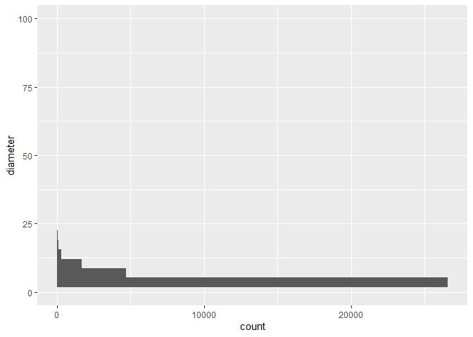
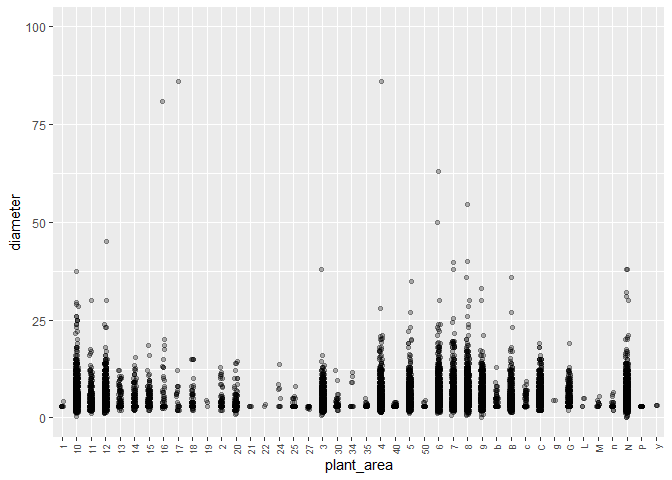
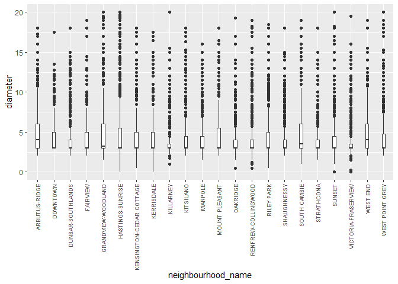
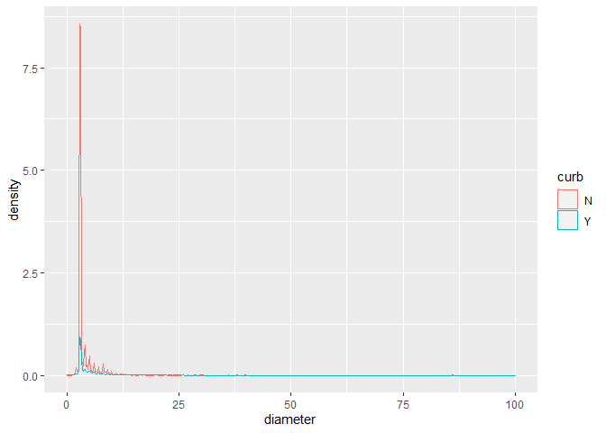
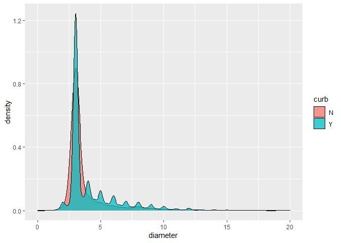
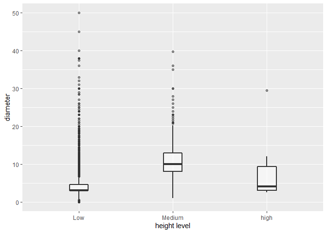
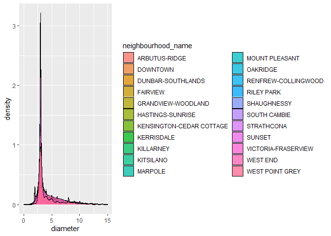
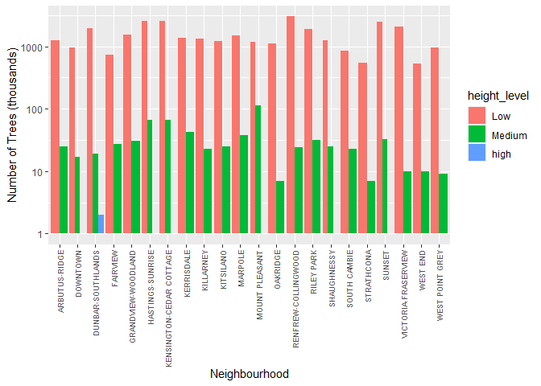

Mini Data-Analysis Deliverable 1
================

# Welcome to your (maybe) first-ever data analysis project!

And hopefully the first of many. Let’s get started:

1.  Install the [`datateachr`](https://github.com/UBC-MDS/datateachr)
    package by typing the following into your **R terminal**:

<!-- -->

    install.packages("devtools")
    devtools::install_github("UBC-MDS/datateachr")

2.  Load the packages below.

``` r
library(datateachr)
library(tidyverse)
```

    ## ── Attaching packages ─────────────────────────────────────── tidyverse 1.3.2 ──
    ## ✔ ggplot2 3.3.6      ✔ purrr   0.3.4 
    ## ✔ tibble  3.1.8      ✔ dplyr   1.0.10
    ## ✔ tidyr   1.2.1      ✔ stringr 1.4.1 
    ## ✔ readr   2.1.2      ✔ forcats 0.5.2 
    ## ── Conflicts ────────────────────────────────────────── tidyverse_conflicts() ──
    ## ✖ dplyr::filter() masks stats::filter()
    ## ✖ dplyr::lag()    masks stats::lag()

3.  Make a repository in the <https://github.com/stat545ubc-2022>
    Organization. You will be working with this repository for the
    entire data analysis project. You can either make it public, or make
    it private and add the TA’s and Lucy as collaborators. A link to
    help you create a private repository is available on the
    \#collaborative-project Slack channel.

# Instructions

## For Both Milestones

-   Each milestone is worth 45 points. The number of points allocated to
    each task will be annotated within each deliverable. Tasks that are
    more challenging will often be allocated more points.

-   10 points will be allocated to the reproducibility, cleanliness, and
    coherence of the overall analysis. While the two milestones will be
    submitted as independent deliverables, the analysis itself is a
    continuum - think of it as two chapters to a story. Each chapter, or
    in this case, portion of your analysis, should be easily followed
    through by someone unfamiliar with the content.
    [Here](https://swcarpentry.github.io/r-novice-inflammation/06-best-practices-R/)
    is a good resource for what constitutes “good code”. Learning good
    coding practices early in your career will save you hassle later on!

## For Milestone 1

**To complete this milestone**, edit [this very `.Rmd`
file](https://raw.githubusercontent.com/UBC-STAT/stat545.stat.ubc.ca/master/content/mini-project/mini-project-1.Rmd)
directly. Fill in the sections that are tagged with
`<!--- start your work below --->`.

**To submit this milestone**, make sure to knit this `.Rmd` file to an
`.md` file by changing the YAML output settings from
`output: html_document` to `output: github_document`. Commit and push
all of your work to the mini-analysis GitHub repository you made
earlier, and tag a release on GitHub. Then, submit a link to your tagged
release on canvas.

**Points**: This milestone is worth 45 points: 43 for your analysis, 1
point for having your Milestone 1 document knit error-free, and 1 point
for tagging your release on Github.

# Learning Objectives

By the end of this milestone, you should:

-   Become familiar with your dataset of choosing
-   Select 4 questions that you would like to answer with your data
-   Generate a reproducible and clear report using R Markdown
-   Become familiar with manipulating and summarizing your data in
    tibbles using `dplyr`, with a research question in mind.

# Task 1: Choose your favorite dataset (10 points)

The `datateachr` package by Hayley Boyce and Jordan Bourak currently
composed of 7 semi-tidy datasets for educational purposes. Here is a
brief description of each dataset:

-   *apt_buildings*: Acquired courtesy of The City of Toronto’s Open
    Data Portal. It currently has 3455 rows and 37 columns.

-   *building_permits*: Acquired courtesy of The City of Vancouver’s
    Open Data Portal. It currently has 20680 rows and 14 columns.

-   *cancer_sample*: Acquired courtesy of UCI Machine Learning
    Repository. It currently has 569 rows and 32 columns.

-   *flow_sample*: Acquired courtesy of The Government of Canada’s
    Historical Hydrometric Database. It currently has 218 rows and 7
    columns.

-   *parking_meters*: Acquired courtesy of The City of Vancouver’s Open
    Data Portal. It currently has 10032 rows and 22 columns.

-   *steam_games*: Acquired courtesy of Kaggle. It currently has 40833
    rows and 21 columns.

-   *vancouver_trees*: Acquired courtesy of The City of Vancouver’s Open
    Data Portal. It currently has 146611 rows and 20 columns.

**Things to keep in mind**

-   We hope that this project will serve as practice for carrying our
    your own *independent* data analysis. Remember to comment your code,
    be explicit about what you are doing, and write notes in this
    markdown document when you feel that context is required. As you
    advance in the project, prompts and hints to do this will be
    diminished - it’ll be up to you!

-   Before choosing a dataset, you should always keep in mind **your
    goal**, or in other ways, *what you wish to achieve with this data*.
    This mini data-analysis project focuses on *data wrangling*,
    *tidying*, and *visualization*. In short, it’s a way for you to get
    your feet wet with exploring data on your own.

And that is exactly the first thing that you will do!

1.1 Out of the 7 datasets available in the `datateachr` package, choose
**4** that appeal to you based on their description. Write your choices
below:

**Note**: We encourage you to use the ones in the `datateachr` package,
but if you have a dataset that you’d really like to use, you can include
it here. But, please check with a member of the teaching team to see
whether the dataset is of appropriate complexity. Also, include a
**brief** description of the dataset here to help the teaching team
understand your data.

<!-------------------------- Start your work below ---------------------------->

1: BC_COVID_Case (Daily reported positive cases of COVID-19 linked with
the date of reported case, health authority where the case was reported
to, age cohort of the case (e.g., \<10, 10-19, 20-29, unknown), and case
sex (male, female, unknown)) 2: 7 3: 6 4: 5

<!----------------------------------------------------------------------------->

1.2 One way to narrowing down your selection is to *explore* the
datasets. Use your knowledge of dplyr to find out at least *3*
attributes about each of these datasets (an attribute is something such
as number of rows, variables, class type…). The goal here is to have an
idea of *what the data looks like*.

*Hint:* This is one of those times when you should think about the
cleanliness of your analysis. I added a single code chunk for you below,
but do you want to use more than one? Would you like to write more
comments outside of the code chunk?

<!-------------------------- Start your work below ---------------------------->

``` r
### EXPLORE HERE ###

### import BC_COVID_Cases
library(readr)
BC_COVID_Cases <- read_csv("BC_COVID_Cases.csv")
```

    ## Warning: One or more parsing issues, see `problems()` for details

    ## Rows: 771202 Columns: 1
    ## ── Column specification ────────────────────────────────────────────────────────
    ## Delimiter: ","
    ## chr (1): <<<<<<< HEAD
    ## 
    ## ℹ Use `spec()` to retrieve the full column specification for this data.
    ## ℹ Specify the column types or set `show_col_types = FALSE` to quiet this message.

``` r
## First 6 rows of dataframe
head(BC_COVID_Cases)
```

    ## # A tibble: 6 × 1
    ##   `<<<<<<< HEAD`                                        
    ##   <chr>                                                 
    ## 1 Reported_Date,HA,Sex,Age_Group,Classification_Reported
    ## 2 2020-01-29,Out of Canada,M,40-49,Lab-diagnosed        
    ## 3 2020-02-06,Vancouver Coastal,F,50-59,Lab-diagnosed    
    ## 4 2020-02-10,Out of Canada,M,30-39,Lab-diagnosed        
    ## 5 2020-02-10,Out of Canada,F,20-29,Lab-diagnosed        
    ## 6 2020-02-18,Interior,F,30-39,Lab-diagnosed

``` r
head(vancouver_trees)
```

    ## # A tibble: 6 × 20
    ##   tree_id civic_number std_str…¹ genus…² speci…³ culti…⁴ commo…⁵ assig…⁶ root_…⁷
    ##     <dbl>        <dbl> <chr>     <chr>   <chr>   <chr>   <chr>   <chr>   <chr>  
    ## 1  149556          494 W 58TH AV ULMUS   AMERIC… BRANDON BRANDO… N       N      
    ## 2  149563          450 W 58TH AV ZELKOVA SERRATA <NA>    JAPANE… N       N      
    ## 3  149579         4994 WINDSOR … STYRAX  JAPONI… <NA>    JAPANE… N       N      
    ## 4  149590          858 E 39TH AV FRAXIN… AMERIC… AUTUMN… AUTUMN… Y       N      
    ## 5  149604         5032 WINDSOR … ACER    CAMPES… <NA>    HEDGE … N       N      
    ## 6  149616          585 W 61ST AV PYRUS   CALLER… CHANTI… CHANTI… N       N      
    ## # … with 11 more variables: plant_area <chr>, on_street_block <dbl>,
    ## #   on_street <chr>, neighbourhood_name <chr>, street_side_name <chr>,
    ## #   height_range_id <dbl>, diameter <dbl>, curb <chr>, date_planted <date>,
    ## #   longitude <dbl>, latitude <dbl>, and abbreviated variable names
    ## #   ¹​std_street, ²​genus_name, ³​species_name, ⁴​cultivar_name, ⁵​common_name,
    ## #   ⁶​assigned, ⁷​root_barrier

``` r
head(steam_games)
```

    ## # A tibble: 6 × 21
    ##      id url          types name  desc_…¹ recen…² all_r…³ relea…⁴ devel…⁵ publi…⁶
    ##   <dbl> <chr>        <chr> <chr> <chr>   <chr>   <chr>   <chr>   <chr>   <chr>  
    ## 1     1 https://sto… app   DOOM  Now in… Very P… Very P… May 12… id Sof… Bethes…
    ## 2     2 https://sto… app   PLAY… PLAYER… Mixed,… Mixed,… Dec 21… PUBG C… PUBG C…
    ## 3     3 https://sto… app   BATT… Take c… Mixed,… Mostly… Apr 24… Harebr… Parado…
    ## 4     4 https://sto… app   DayZ  The po… Mixed,… Mixed,… Dec 13… Bohemi… Bohemi…
    ## 5     5 https://sto… app   EVE … EVE On… Mixed,… Mostly… May 6,… CCP     CCP,CCP
    ## 6     6 https://sto… bund… Gran… Grand … NaN     NaN     NaN     Rockst… Rockst…
    ## # … with 11 more variables: popular_tags <chr>, game_details <chr>,
    ## #   languages <chr>, achievements <dbl>, genre <chr>, game_description <chr>,
    ## #   mature_content <chr>, minimum_requirements <chr>,
    ## #   recommended_requirements <chr>, original_price <dbl>, discount_price <dbl>,
    ## #   and abbreviated variable names ¹​desc_snippet, ²​recent_reviews,
    ## #   ³​all_reviews, ⁴​release_date, ⁵​developer, ⁶​publisher

``` r
head(parking_meters)
```

    ## # A tibble: 6 × 22
    ##   meter_head  r_mf_9a_6p r_mf_…¹ r_sa_…² r_sa_…³ r_su_…⁴ r_su_…⁵ rate_…⁶ time_…⁷
    ##   <chr>       <chr>      <chr>   <chr>   <chr>   <chr>   <chr>   <chr>   <chr>  
    ## 1 Twin        $2.00      $4.00   $2.00   $4.00   $2.00   $4.00   <NA>    METER …
    ## 2 Pay Station $1.00      $1.00   $1.00   $1.00   $1.00   $1.00   $ .50   METER …
    ## 3 Twin        $1.00      $1.00   $1.00   $1.00   $1.00   $1.00   <NA>    METER …
    ## 4 Single      $1.00      $1.00   $1.00   $1.00   $1.00   $1.00   <NA>    METER …
    ## 5 Twin        $2.00      $1.00   $2.00   $1.00   $2.00   $1.00   <NA>    METER …
    ## 6 Twin        $2.00      $1.00   $2.00   $1.00   $2.00   $1.00   <NA>    METER …
    ## # … with 13 more variables: t_mf_9a_6p <chr>, t_mf_6p_10 <chr>,
    ## #   t_sa_9a_6p <chr>, t_sa_6p_10 <chr>, t_su_9a_6p <chr>, t_su_6p_10 <chr>,
    ## #   time_misc <chr>, credit_card <chr>, pay_phone <chr>, longitude <dbl>,
    ## #   latitude <dbl>, geo_local_area <chr>, meter_id <chr>, and abbreviated
    ## #   variable names ¹​r_mf_6p_10, ²​r_sa_9a_6p, ³​r_sa_6p_10, ⁴​r_su_9a_6p,
    ## #   ⁵​r_su_6p_10, ⁶​rate_misc, ⁷​time_in_effect

``` r
## Last 6 rows of dataframe
tail(BC_COVID_Cases)
```

    ## # A tibble: 6 × 1
    ##   `<<<<<<< HEAD`                                    
    ##   <chr>                                             
    ## 1 2022-10-01,Vancouver Coastal,M,60-69,Lab-diagnosed
    ## 2 2022-10-01,Vancouver Island,M,80-89,Lab-diagnosed 
    ## 3 2022-10-01,Vancouver Island,F,30-39,Lab-diagnosed 
    ## 4 2022-10-01,Vancouver Island,M,60-69,Lab-diagnosed 
    ## 5 2022-10-01,Fraser,M,70-79,Lab-diagnosed           
    ## 6 >>>>>>> 52c0a0809daa3ab54322ac8ef30cdfc22fe0609b

``` r
tail(vancouver_trees)
```

    ## # A tibble: 6 × 20
    ##   tree_id civic_number std_str…¹ genus…² speci…³ culti…⁴ commo…⁵ assig…⁶ root_…⁷
    ##     <dbl>        <dbl> <chr>     <chr>   <chr>   <chr>   <chr>   <chr>   <chr>  
    ## 1  228828         3506 W 39TH AV ULMUS   AMERIC… BRANDON BRANDO… N       N      
    ## 2  228832         7061 CAMBIE ST PICEA   LIKIAN… PURPUR… PURPLE… Y       N      
    ## 3  228834         7061 CAMBIE ST ABIES   GRANDIS <NA>    GRAND … Y       N      
    ## 4  228837         2191 VENABLES… MAGNOL… KOBUS   <NA>    KOBUS … N       N      
    ## 5  228839         7356 MAPLE ST  ACER    RUBRUM  AUTUMN… AUTUMN… N       N      
    ## 6  228841         1468 W 73RD AV PRUNUS  SERRUL… SHIROF… SHIROF… N       N      
    ## # … with 11 more variables: plant_area <chr>, on_street_block <dbl>,
    ## #   on_street <chr>, neighbourhood_name <chr>, street_side_name <chr>,
    ## #   height_range_id <dbl>, diameter <dbl>, curb <chr>, date_planted <date>,
    ## #   longitude <dbl>, latitude <dbl>, and abbreviated variable names
    ## #   ¹​std_street, ²​genus_name, ³​species_name, ⁴​cultivar_name, ⁵​common_name,
    ## #   ⁶​assigned, ⁷​root_barrier

``` r
tail(steam_games)
```

    ## # A tibble: 6 × 21
    ##      id url          types name  desc_…¹ recen…² all_r…³ relea…⁴ devel…⁵ publi…⁶
    ##   <dbl> <chr>        <chr> <chr> <chr>   <chr>   <chr>   <chr>   <chr>   <chr>  
    ## 1 40828 https://sto… app   Rock… NaN     <NA>    <NA>    Feb 12… Ubisof… <NA>   
    ## 2 40829 https://sto… app   Rock… NaN     <NA>    <NA>    Feb 12… Ubisof… <NA>   
    ## 3 40830 https://sto… app   Rock… NaN     <NA>    <NA>    Feb 5,… Ubisof… <NA>   
    ## 4 40831 https://sto… app   Fant… NaN     <NA>    <NA>    Jul 31… SmiteW… <NA>   
    ## 5 40832 https://sto… app   Mega… NaN     <NA>    <NA>    Jul 24… CAPCOM… CAPCOM…
    ## 6 40833 https://sto… app   Stor… An RPG… <NA>    <NA>    Aug 8,… 16 Bit… Self-P…
    ## # … with 11 more variables: popular_tags <chr>, game_details <chr>,
    ## #   languages <chr>, achievements <dbl>, genre <chr>, game_description <chr>,
    ## #   mature_content <chr>, minimum_requirements <chr>,
    ## #   recommended_requirements <chr>, original_price <dbl>, discount_price <dbl>,
    ## #   and abbreviated variable names ¹​desc_snippet, ²​recent_reviews,
    ## #   ³​all_reviews, ⁴​release_date, ⁵​developer, ⁶​publisher

``` r
tail(parking_meters)
```

    ## # A tibble: 6 × 22
    ##   meter_head r_mf_9a_6p r_mf_6…¹ r_sa_…² r_sa_…³ r_su_…⁴ r_su_…⁵ rate_…⁶ time_…⁷
    ##   <chr>      <chr>      <chr>    <chr>   <chr>   <chr>   <chr>   <chr>   <chr>  
    ## 1 Twin       $1.00      $1.00    $1.00   $1.00   $1.00   $1.00   <NA>    METER …
    ## 2 Twin       $1.00      $1.00    $1.00   $1.00   $1.00   $1.00   <NA>    METER …
    ## 3 Twin       $1.00      $1.00    $1.00   $1.00   $1.00   $1.00   <NA>    METER …
    ## 4 Twin       $1.00      $1.00    $1.00   $1.00   $1.00   $1.00   <NA>    METER …
    ## 5 Twin       $1.00      $1.00    $1.00   $1.00   $1.00   $1.00   <NA>    METER …
    ## 6 Twin       $1.00      $1.00    $1.00   $1.00   $1.00   $1.00   <NA>    METER …
    ## # … with 13 more variables: t_mf_9a_6p <chr>, t_mf_6p_10 <chr>,
    ## #   t_sa_9a_6p <chr>, t_sa_6p_10 <chr>, t_su_9a_6p <chr>, t_su_6p_10 <chr>,
    ## #   time_misc <chr>, credit_card <chr>, pay_phone <chr>, longitude <dbl>,
    ## #   latitude <dbl>, geo_local_area <chr>, meter_id <chr>, and abbreviated
    ## #   variable names ¹​r_mf_6p_10, ²​r_sa_9a_6p, ³​r_sa_6p_10, ⁴​r_su_9a_6p,
    ## #   ⁵​r_su_6p_10, ⁶​rate_misc, ⁷​time_in_effect

``` r
## format of data
class(BC_COVID_Cases)
```

    ## [1] "spec_tbl_df" "tbl_df"      "tbl"         "data.frame"

``` r
class(vancouver_trees)
```

    ## [1] "tbl_df"     "tbl"        "data.frame"

``` r
class(steam_games)
```

    ## [1] "spec_tbl_df" "tbl_df"      "tbl"         "data.frame"

``` r
class(parking_meters)
```

    ## [1] "tbl_df"     "tbl"        "data.frame"

``` r
## dimension and data types within the dataframe (structure)
glimpse(BC_COVID_Cases)
```

    ## Rows: 771,202
    ## Columns: 1
    ## $ `<<<<<<< HEAD` <chr> "Reported_Date,HA,Sex,Age_Group,Classification_Reported…

``` r
glimpse(vancouver_trees)
```

    ## Rows: 146,611
    ## Columns: 20
    ## $ tree_id            <dbl> 149556, 149563, 149579, 149590, 149604, 149616, 149…
    ## $ civic_number       <dbl> 494, 450, 4994, 858, 5032, 585, 4909, 4925, 4969, 7…
    ## $ std_street         <chr> "W 58TH AV", "W 58TH AV", "WINDSOR ST", "E 39TH AV"…
    ## $ genus_name         <chr> "ULMUS", "ZELKOVA", "STYRAX", "FRAXINUS", "ACER", "…
    ## $ species_name       <chr> "AMERICANA", "SERRATA", "JAPONICA", "AMERICANA", "C…
    ## $ cultivar_name      <chr> "BRANDON", NA, NA, "AUTUMN APPLAUSE", NA, "CHANTICL…
    ## $ common_name        <chr> "BRANDON ELM", "JAPANESE ZELKOVA", "JAPANESE SNOWBE…
    ## $ assigned           <chr> "N", "N", "N", "Y", "N", "N", "N", "N", "N", "N", "…
    ## $ root_barrier       <chr> "N", "N", "N", "N", "N", "N", "N", "N", "N", "N", "…
    ## $ plant_area         <chr> "N", "N", "4", "4", "4", "B", "6", "6", "3", "3", "…
    ## $ on_street_block    <dbl> 400, 400, 4900, 800, 5000, 500, 4900, 4900, 4900, 7…
    ## $ on_street          <chr> "W 58TH AV", "W 58TH AV", "WINDSOR ST", "E 39TH AV"…
    ## $ neighbourhood_name <chr> "MARPOLE", "MARPOLE", "KENSINGTON-CEDAR COTTAGE", "…
    ## $ street_side_name   <chr> "EVEN", "EVEN", "EVEN", "EVEN", "EVEN", "ODD", "ODD…
    ## $ height_range_id    <dbl> 2, 4, 3, 4, 2, 2, 3, 3, 2, 2, 2, 5, 3, 2, 2, 2, 2, …
    ## $ diameter           <dbl> 10.00, 10.00, 4.00, 18.00, 9.00, 5.00, 15.00, 14.00…
    ## $ curb               <chr> "N", "N", "Y", "Y", "Y", "Y", "Y", "Y", "Y", "Y", "…
    ## $ date_planted       <date> 1999-01-13, 1996-05-31, 1993-11-22, 1996-04-29, 19…
    ## $ longitude          <dbl> -123.1161, -123.1147, -123.0846, -123.0870, -123.08…
    ## $ latitude           <dbl> 49.21776, 49.21776, 49.23938, 49.23469, 49.23894, 4…

``` r
glimpse(steam_games)
```

    ## Rows: 40,833
    ## Columns: 21
    ## $ id                       <dbl> 1, 2, 3, 4, 5, 6, 7, 8, 9, 10, 11, 12, 13, 14…
    ## $ url                      <chr> "https://store.steampowered.com/app/379720/DO…
    ## $ types                    <chr> "app", "app", "app", "app", "app", "bundle", …
    ## $ name                     <chr> "DOOM", "PLAYERUNKNOWN'S BATTLEGROUNDS", "BAT…
    ## $ desc_snippet             <chr> "Now includes all three premium DLC packs (Un…
    ## $ recent_reviews           <chr> "Very Positive,(554),- 89% of the 554 user re…
    ## $ all_reviews              <chr> "Very Positive,(42,550),- 92% of the 42,550 u…
    ## $ release_date             <chr> "May 12, 2016", "Dec 21, 2017", "Apr 24, 2018…
    ## $ developer                <chr> "id Software", "PUBG Corporation", "Harebrain…
    ## $ publisher                <chr> "Bethesda Softworks,Bethesda Softworks", "PUB…
    ## $ popular_tags             <chr> "FPS,Gore,Action,Demons,Shooter,First-Person,…
    ## $ game_details             <chr> "Single-player,Multi-player,Co-op,Steam Achie…
    ## $ languages                <chr> "English,French,Italian,German,Spanish - Spai…
    ## $ achievements             <dbl> 54, 37, 128, NA, NA, NA, 51, 55, 34, 43, 72, …
    ## $ genre                    <chr> "Action", "Action,Adventure,Massively Multipl…
    ## $ game_description         <chr> "About This Game Developed by id software, th…
    ## $ mature_content           <chr> NA, "Mature Content Description  The develope…
    ## $ minimum_requirements     <chr> "Minimum:,OS:,Windows 7/8.1/10 (64-bit versio…
    ## $ recommended_requirements <chr> "Recommended:,OS:,Windows 7/8.1/10 (64-bit ve…
    ## $ original_price           <dbl> 19.99, 29.99, 39.99, 44.99, 0.00, NA, 59.99, …
    ## $ discount_price           <dbl> 14.99, NA, NA, NA, NA, 35.18, 70.42, 17.58, N…

``` r
glimpse(parking_meters)
```

    ## Rows: 10,032
    ## Columns: 22
    ## $ meter_head     <chr> "Twin", "Pay Station", "Twin", "Single", "Twin", "Twin"…
    ## $ r_mf_9a_6p     <chr> "$2.00", "$1.00", "$1.00", "$1.00", "$2.00", "$2.00", "…
    ## $ r_mf_6p_10     <chr> "$4.00", "$1.00", "$1.00", "$1.00", "$1.00", "$1.00", "…
    ## $ r_sa_9a_6p     <chr> "$2.00", "$1.00", "$1.00", "$1.00", "$2.00", "$2.00", "…
    ## $ r_sa_6p_10     <chr> "$4.00", "$1.00", "$1.00", "$1.00", "$1.00", "$1.00", "…
    ## $ r_su_9a_6p     <chr> "$2.00", "$1.00", "$1.00", "$1.00", "$2.00", "$2.00", "…
    ## $ r_su_6p_10     <chr> "$4.00", "$1.00", "$1.00", "$1.00", "$1.00", "$1.00", "…
    ## $ rate_misc      <chr> NA, "$ .50", NA, NA, NA, NA, NA, NA, NA, NA, NA, NA, NA…
    ## $ time_in_effect <chr> "METER IN EFFECT: 9:00 AM TO 10:00 PM", "METER IN EFFEC…
    ## $ t_mf_9a_6p     <chr> "2 Hr", "10 Hrs", "2 Hr", "2 Hr", "2 Hr", "3 Hr", "2 Hr…
    ## $ t_mf_6p_10     <chr> "4 Hr", "10 Hrs", "4 Hr", "4 Hr", "4 Hr", "4 Hr", "4 Hr…
    ## $ t_sa_9a_6p     <chr> "2 Hr", "10 Hrs", "2 Hr", "2 Hr", "2 Hr", "3 Hr", "2 Hr…
    ## $ t_sa_6p_10     <chr> "4 Hr", "10 Hrs", "4 Hr", "4 Hr", "4 Hr", "4 Hr", "4 Hr…
    ## $ t_su_9a_6p     <chr> "2 Hr", "10 Hrs", "2 Hr", "2 Hr", "2 Hr", "3 Hr", "2 Hr…
    ## $ t_su_6p_10     <chr> "4 Hr", "10 Hrs", "4 Hr", "4 Hr", "4 Hr", "4 Hr", "4 Hr…
    ## $ time_misc      <chr> NA, "No Time Limit", NA, NA, NA, NA, NA, NA, NA, NA, NA…
    ## $ credit_card    <chr> "No", "Yes", "No", "No", "No", "No", "No", "No", "No", …
    ## $ pay_phone      <chr> "66890", "59916", "57042", "57159", "51104", "60868", "…
    ## $ longitude      <dbl> -123.1289, -123.0982, -123.1013, -123.1862, -123.1278, …
    ## $ latitude       <dbl> 49.28690, 49.27215, 49.25468, 49.26341, 49.26354, 49.27…
    ## $ geo_local_area <chr> "West End", "Strathcona", "Riley Park", "West Point Gre…
    ## $ meter_id       <chr> "670805", "471405", "C80145", "D03704", "301023", "5913…

<!----------------------------------------------------------------------------->

1.3 Now that you’ve explored the 4 datasets that you were initially most
interested in, let’s narrow it down to 2. What lead you to choose these
2? Briefly explain your choices below, and feel free to include any code
in your explanation.

<!-------------------------- Start your work below ---------------------------->

I will choose `BC_COVID_Cases` and `vancouver_trees`. `steam_games` has
way too many columns consisting of solely character strings and the
strings include very long descriptions of each name (e.g., columns such
as `desc_snippet`, `recent_reviews`, `all_reviews`, `popular_tags`,
`recommended_requirements`), which made difficult to perform
quantitative analysis and graphing. Additionally, `parking_meters` has
most columns comprised of solely prices at different time intervals,
which would be difficult to explore their relationships (prices also in
the character string format). However, for `BC_COVID_Cases`, I can look
at the relationship between age group and case sex ratio. For
`Vancouver_trees`, I can investigate the height and its relationship
with different tree species (or the relationship between height and
diameter). Therefore, I would rather choose the `BC_COVID_Cases` and
`vancouver_trees` for my analysis due to higher significance and
meaningfulness in exploring the relationships between factors of
interests.

<!----------------------------------------------------------------------------->

1.4 Time for the final decision! Going back to the beginning, it’s
important to have an *end goal* in mind. For example, if I had chosen
the `titanic` dataset for my project, I might’ve wanted to explore the
relationship between survival and other variables. Try to think of 1
research question that you would want to answer with each dataset. Note
them down below, and make your final choice based on what seems more
interesting to you!

If I had chosen the `vancouver_trees` dataset, I would explore the
relationship between height and diameter. If I had chosen the
`parking_meters` dataset, I would explore the relationship between
prices and the meter type. If I had chosen the `steam_games` dataset, I
would explore the relationship between genre and original price. If I
had chosen the `BC_COVID_Cases` dataset, I would explore the
relationship between age group and case sex ratio.

I would choose the `vancouver_trees` dataset as it yields more interests
to me.

<!-------------------------- Start your work below ---------------------------->
<!----------------------------------------------------------------------------->

# Important note

Read Tasks 2 and 3 *fully* before starting to complete either of them.
Probably also a good point to grab a coffee to get ready for the fun
part!

This project is semi-guided, but meant to be *independent*. For this
reason, you will complete tasks 2 and 3 below (under the **START HERE**
mark) as if you were writing your own exploratory data analysis report,
and this guidance never existed! Feel free to add a brief introduction
section to your project, format the document with markdown syntax as you
deem appropriate, and structure the analysis as you deem appropriate.
Remember, marks will be awarded for completion of the 4 tasks, but 10
points of the whole project are allocated to a reproducible and clean
analysis. If you feel lost, you can find a sample data analysis
[here](https://www.kaggle.com/headsortails/tidy-titarnic) to have a
better idea. However, bear in mind that it is **just an example** and
you will not be required to have that level of complexity in your
project.

# Task 2: Exploring your dataset (15 points)

If we rewind and go back to the learning objectives, you’ll see that by
the end of this deliverable, you should have formulated *4* research
questions about your data that you may want to answer during your
project. However, it may be handy to do some more exploration on your
dataset of choice before creating these questions - by looking at the
data, you may get more ideas. **Before you start this task, read all
instructions carefully until you reach START HERE under Task 3**.

2.1 Complete *4 out of the following 8 exercises* to dive deeper into
your data. All datasets are different and therefore, not all of these
tasks may make sense for your data - which is why you should only answer
*4*. Use *dplyr* and *ggplot*.

1.  Plot the distribution of a numeric variable.
2.  Create a new variable based on other variables in your data (only if
    it makes sense)
3.  Investigate how many missing values there are per variable. Can you
    find a way to plot this?
4.  Explore the relationship between 2 variables in a plot.
5.  Filter observations in your data according to your own criteria.
    Think of what you’d like to explore - again, if this was the
    `titanic` dataset, I may want to narrow my search down to passengers
    born in a particular year…
6.  Use a boxplot to look at the frequency of different observations
    within a single variable. You can do this for more than one variable
    if you wish!
7.  Make a new tibble with a subset of your data, with variables and
    observations that you are interested in exploring.
8.  Use a density plot to explore any of your variables (that are
    suitable for this type of plot).

2.2 For each of the 4 exercises that you complete, provide a *brief
explanation* of why you chose that exercise in relation to your data (in
other words, why does it make sense to do that?), and sufficient
comments for a reader to understand your reasoning and code.

<!-------------------------- Start your work below ---------------------------->

## Filter (subset) the observations (trees) to the years between 2000 and 2018

**We drop missing values for all variables except lats and longs since
these two variables do not interfere with my scope of analysis.**

``` r
vancouver_trees_2000_18 <- vancouver_trees %>% filter(between(date_planted, as.Date("2000-01-01"), as.Date("2018-12-31"))) %>% drop_na(-latitude, -longitude)
```

## Plot the distribution of tree diameter

``` r
vancouver_trees_2000_18 %>% ggplot(aes(y = diameter)) + 
  geom_histogram() +
  ylim(0, 100)
```

    ## `stat_bin()` using `bins = 30`. Pick better value with `binwidth`.

    ## Warning: Removed 1 rows containing non-finite values (stat_bin).

    ## Warning: Removed 2 rows containing missing values (geom_bar).

<!-- -->

## Explore the relationship between plant area and tree diameter

``` r
vancouver_trees_2000_18 %>% 
  ggplot(aes(plant_area, diameter)) +
  geom_jitter(width = 0.1, alpha = 0.3) +
  ylim(0, 100) +
  theme(axis.text.x = element_text(angle = 90, vjust = 0.5, hjust=1, size = 7))
```

    ## Warning: Removed 3 rows containing missing values (geom_point).

<!-- -->

## Use a boxplot to look at the frequency of tree diameters within different neighbourhoods

``` r
vancouver_trees_2000_18 %>% 
  ggplot(aes(neighbourhood_name, diameter)) +
  geom_boxplot(width = 0.2) +
  ylim(0, 20) +
  theme(axis.text.x = element_text(angle = 90, vjust = 0.5, hjust=1, size = 7))
```

    ## Warning: Removed 69 rows containing non-finite values (stat_boxplot).

<!-- -->

## Use a density plot to explore diameters with curbings (yes/no) (Compare the diameter with curbing or not)

``` r
vancouver_trees_2000_18 %>%
  ggplot(aes(diameter)) +
  geom_density(aes(color = curb)) +
  xlim(0, 100)
```

    ## Warning: Removed 1 rows containing non-finite values (stat_density).

<!-- -->

<!----------------------------------------------------------------------------->

# Task 3: Write your research questions (5 points)

So far, you have chosen a dataset and gotten familiar with it through
exploring the data. Now it’s time to figure out 4 research questions
that you would like to answer with your data! Write the 4 questions and
any additional comments at the end of this deliverable. These questions
are not necessarily set in stone - TAs will review them and give you
feedback; therefore, you may choose to pursue them as they are for the
rest of the project, or make modifications!

<!--- *****START HERE***** --->

1.  What is the relationship between tree diameters and curbing
    (yes/no)?
2.  What is the relationship between height level and tree diameters?
3.  Which neighbourhood has the highest “on average” tree diameters? How
    do the tree diameters differ across different neighbourhood?
4.  Which height level contains the highest number of trees among which
    neighbourhood?

# Task 4: Process and summarize your data (13 points)

From Task 2, you should have an idea of the basic structure of your
dataset (e.g. number of rows and columns, class types, etc.). Here, we
will start investigating your data more in-depth using various data
manipulation functions.

### 1.1 (10 points)

Now, for each of your four research questions, choose one task from
options 1-4 (summarizing), and one other task from 4-8 (graphing). You
should have 2 tasks done for each research question (8 total). Make sure
it makes sense to do them! (e.g. don’t use a numerical variables for a
task that needs a categorical variable.). Comment on why each task helps
(or doesn’t!) answer the corresponding research question.

Ensure that the output of each operation is printed!

**Summarizing:**

1.  Compute the *range*, *mean*, and *two other summary statistics* of
    **one numerical variable** across the groups of **one categorical
    variable** from your data.
2.  Compute the number of observations for at least one of your
    categorical variables. Do not use the function `table()`!
3.  Create a categorical variable with 3 or more groups from an existing
    numerical variable. You can use this new variable in the other
    tasks! *An example: age in years into “child, teen, adult, senior”.*
4.  Based on two categorical variables, calculate two summary statistics
    of your choosing.

**Graphing:**

5.  Create a graph out of summarized variables that has at least two
    geom layers.
6.  Create a graph of your choosing, make one of the axes logarithmic,
    and format the axes labels so that they are “pretty” or easier to
    read.
7.  Make a graph where it makes sense to customize the alpha
    transparency.
8.  Create 3 histograms out of summarized variables, with each histogram
    having different sized bins. Pick the “best” one and explain why it
    is the best.

Make sure it’s clear what research question you are doing each operation
for!

<!------------------------- Start your work below ----------------------------->

## RQ 1

``` r
# Calculate the summary statistics (mean, range, median, IQR, and SD) for the diameters for both curbing and no curbing
RQ_1_mean <- vancouver_trees_2000_18 %>%
  group_by(curb) %>% 
  summarize(diameter_mean = mean(diameter, na.rm=T))

RQ_1_range <- vancouver_trees_2000_18 %>%
  group_by(curb) %>% 
  summarize(diameter_range = range(diameter, na.rm=T))
```

    ## `summarise()` has grouped output by 'curb'. You can override using the
    ## `.groups` argument.

``` r
RQ_1_median <- vancouver_trees_2000_18 %>%
  group_by(curb) %>% 
  summarize(diameter_median = median(diameter, na.rm=T))

RQ_1_IQR <- vancouver_trees_2000_18 %>%
  group_by(curb) %>% 
  summarize(diameter_IQR = IQR(diameter, na.rm=T))

RQ_1_SD <- vancouver_trees_2000_18 %>%
  group_by(curb) %>% 
  summarize(diameter_SD = sd(diameter, na.rm=T))

# Kernel density plot for the tree diameters with curbing and no curbing
vancouver_trees_2000_18 %>%
  ggplot(aes(diameter)) +
  geom_density(aes(fill = curb), alpha = 0.75) +
  xlim(0, 20)
```

    ## Warning: Removed 69 rows containing non-finite values (stat_density).

<!-- -->

It slightly helps answering RQ 1 because from the statistical mean
diameter for curbing (yes/no) and their kernel density distributions, we
can infer that they are similar but the other summary statistics
(e.g. range, IQR, SD) also provide more information in which no curbing
has higher diameter range and SD meaning more spread out than with
curbing. However, no curbing has lower IQR than with curbing.

## RQ 2

``` r
# Create a categorical variable (height_level) with 3 groups from an existing numerical variable (height_range_id)
height_class <- cut(vancouver_trees_2000_18$height_range_id,
                                            breaks=c(-Inf, 3, 6, Inf),
                                            labels=c('Low', 'Medium', 'high'))
vancouver_trees_2000_18$height_level <- factor(height_class)

# Boxplot for comparing the tree diameters across three levels of heights
vancouver_trees_2000_18 %>% 
  ggplot(aes(height_level, diameter)) +
  geom_boxplot(width = 0.2, size = 0.8, alpha = 0.5) +
  xlab("height level") +
  ylim(0,50)
```

    ## Warning: Removed 6 rows containing non-finite values (stat_boxplot).

<!-- --> It
helps answer RQ2 since by looking at the boxplot, we can infer that
roughly medium height trees have the highest “on average” diameters.
However, to deduct if the differences in diameters between these three
height levels are statistically significant, we need to use ANOVA to
infer the relationship. The descriptive boxplot only gives a rough
estimate of the relationship.

## RQ 3

``` r
# Calculate the summary statistics (mean, range, median, IQR, and SD) for the diameters for all neighbourhoods

RQ_3_summary <- vancouver_trees_2000_18 %>%
  group_by(neighbourhood_name) %>% 
  summarize(diameter_mean = mean(diameter, na.rm=T),
            diameter_range = range(diameter, na.rm=T),
            diameter_IQR = IQR(diameter, na.rm=T),
            diameter_SD = sd(diameter, na.rm=T),
            diameter_median = median(diameter, na.rm=T))
```

    ## `summarise()` has grouped output by 'neighbourhood_name'. You can override
    ## using the `.groups` argument.

``` r
# Kernel density plot for the tree diameters across all neighbourhoods
vancouver_trees_2000_18 %>%
  ggplot(aes(diameter)) +
  geom_density(aes(fill = neighbourhood_name), alpha = 0.75) +
  xlim(0, 15)
```

    ## Warning: Removed 203 rows containing non-finite values (stat_density).

<!-- -->

The summary statistics give a comprehensive overview of the diameters
across all neighbourhoods (like RQ1), but the kernel density plots here
have too many neighbourhoods contained in which would lead to harder
visualization (deviation from the focus); therefore, it is perhaps
better to use other statistical analysis tools/methods to investigate
how tree diameters differ across the neighbourhoods. Overall from this
density plot, we can see almost no difference in the distribution of
diameters across neighbourhoods.

## RQ 4

``` r
# Find the number of trees for each height level within each neighbourhood
RQ4 <- vancouver_trees_2000_18 %>% 
  group_by(neighbourhood_name, height_level) %>% 
  summarize(n = n())
```

    ## `summarise()` has grouped output by 'neighbourhood_name'. You can override
    ## using the `.groups` argument.

``` r
# plot the number of trees for each height level for each neighbourhood (count in logarithmic)
vancouver_trees_2000_18 %>% ggplot(aes(neighbourhood_name, fill=height_level)) +
  geom_bar(position = "dodge") +
  scale_y_log10("Number of Trees (thousands)") +
  xlab("Neighbourhood") +
  theme(axis.text.x = element_text(angle = 90, vjust = 0.5, hjust=1, size = 7)) 
```

<!-- --> It
answers RQ 4 because we are investigating Which height level contains
the highest number of trees among which neighbourhood and the
side-by-side bar charts visually provides the information in which we
can directly see their relationships.

<!----------------------------------------------------------------------------->

### 1.2 (3 points)

Based on the operations that you’ve completed, how much closer are you
to answering your research questions? Think about what aspects of your
research questions remain unclear. Can your research questions be
refined, now that you’ve investigated your data a bit more? Which
research questions are yielding interesting results?

From all research questions, these plots all give a rough and
preliminary estimate of how the bivariate or perhaps multivariate
relationships would look like. However, as discussed above, many of the
visual representations only give a rough overview and I’m interested in
detecting the statistical differences and relationships between these
variables of interests and perhaps adding more complexity by using more
statistical analysis methods could help. From the density plots for RQ1
and 3， there are almost no relationships between tree diameters and
curbing, and tree diameters variations across neighbourhoods. I would
say RQ2 provides the most interesting results as I always think higher
height would be associated with larger diameters (hypothesis) and in
reality, trees of medium height actually yields relatively largest
diameter.

<!-------------------------- Start your work below ---------------------------->
<!----------------------------------------------------------------------------->

### Attribution

Thanks to Icíar Fernández Boyano for mostly putting this together, and
Vincenzo Coia for launching.
